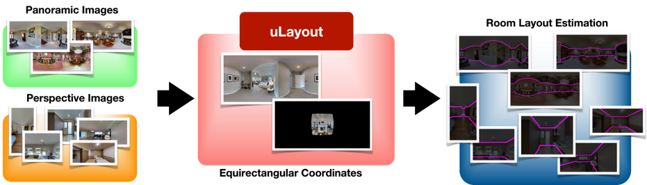

# uLayout: Unified Room Layout Estimation for Perspective and Panoramic Images
<div style="text-align: center;">
    Jonathan Lee<sup>1</sup>,
    Bolivar Solarte<sup>1</sup>,
    Chin-Hsuan Wu<sup>1</sup>,
    Jin-Cheng Jhang<sup>1</sup>,
    Fu-En Wang<sup>1</sup>,
    Yi-Hsuan Tsai<sup>2</sup>,
    Min Sun<sup>1</sup>
</div>

<div style="text-align: center;">
  <!-- affiliations -->
  <p class="subtitle is-5" style="font-size: 1.0em; text-align: center;"> 
    <sup>1</sup> National Tsing Hua University, Taiwan
    <sup>2</sup> Atmanity Inc.
  </p>
</div>


<p align="center"> 
  <a href="https://arxiv.org/abs/2503.21562" target='_**blank**'>
    
    </a>
  <a href="https://openaccess.thecvf.com/content/WACV2025/supplemental/Lee_uLayout_Unified_Room_WACV_2025_supplemental.pdf" target='_**blank**'>
    
    </a>
</p>


<div style="text-align: center;">
  
</div>

## 🚀 News
- [2025/03/27] Paper released on arXiv.
- Code will release soon in April 2025.

## 📝 Citation
If you find our work useful in your research, please consider citing:
```bibtex
@InProceedings{Lee2025uLayout,
    author    = {Lee, Jonathan and E Solarte, Bolivar and Wu, Chin-Hsuan and Jhang, Jin-Cheng and Wang, Fu-En and Tsai, Yi-Hsuan and Sun, Min},
    title     = {uLayout: Unified Room Layout Estimation for Perspective and Panoramic Images},
    booktitle = {Proceedings of the Winter Conference on Applications of Computer Vision (WACV)},
    month     = {February},
    year      = {2025},
    pages     = {8399-8408}
}
```